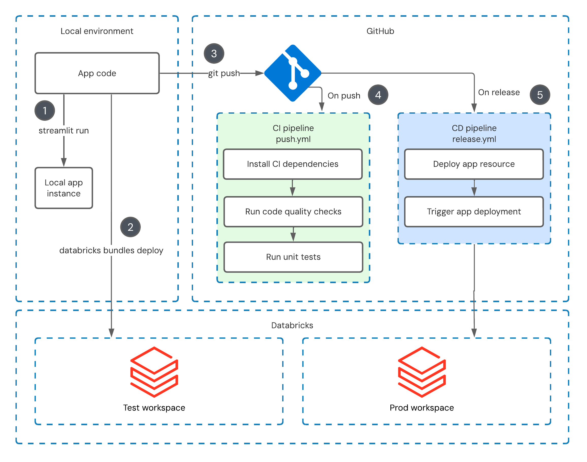
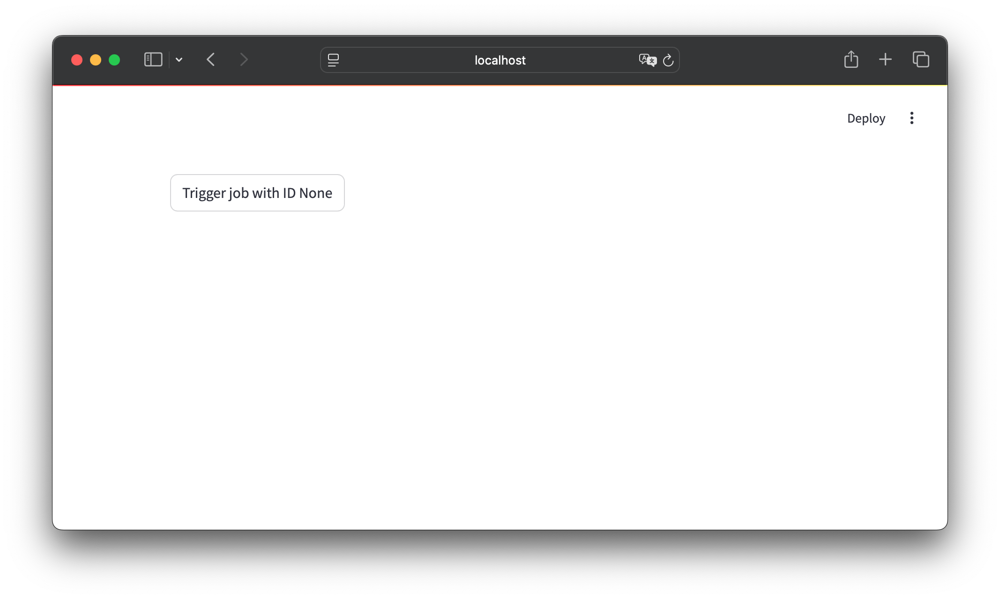
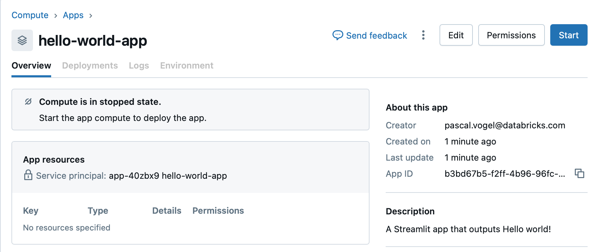
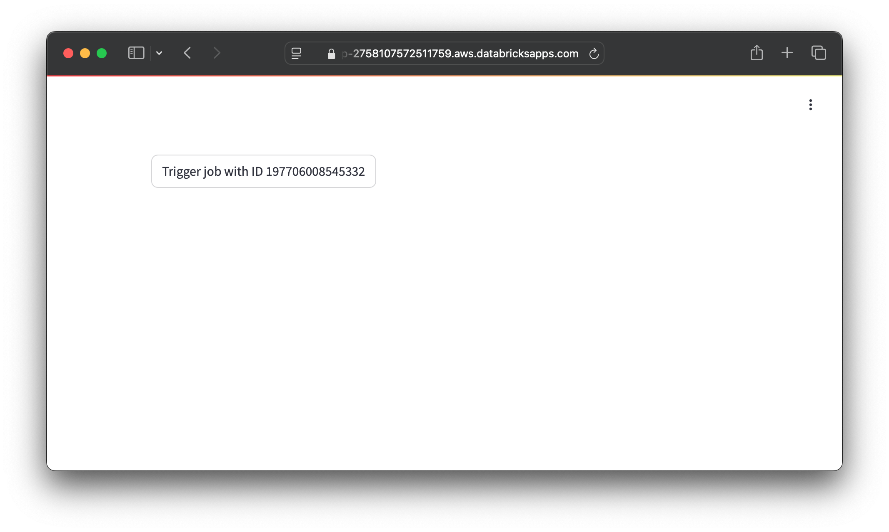
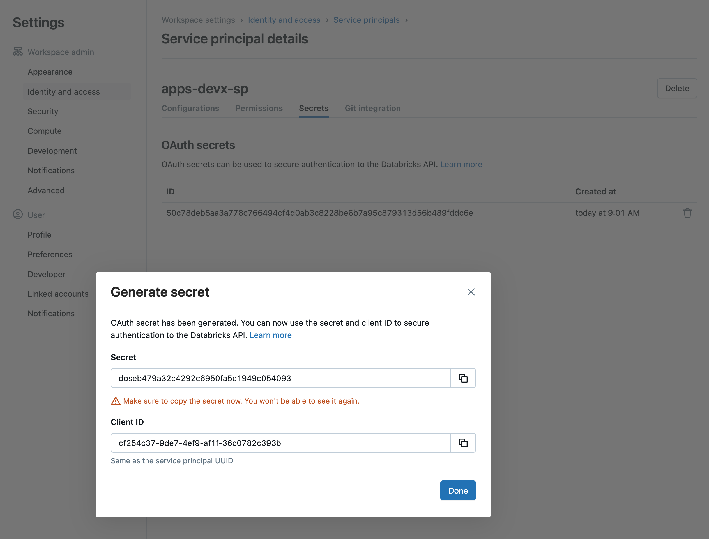
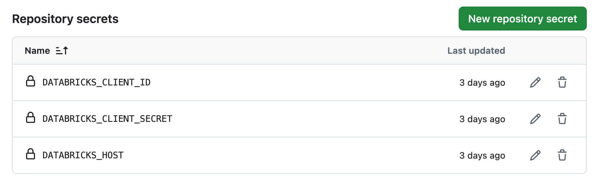
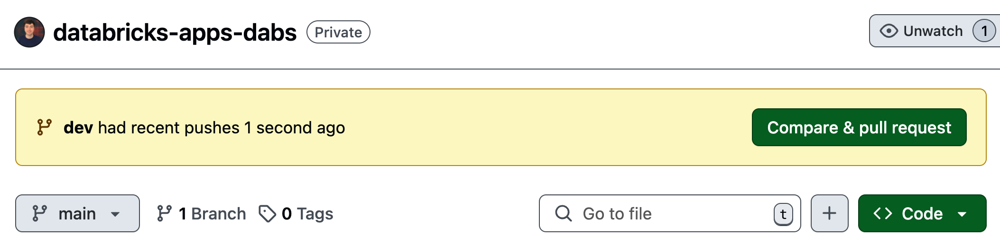
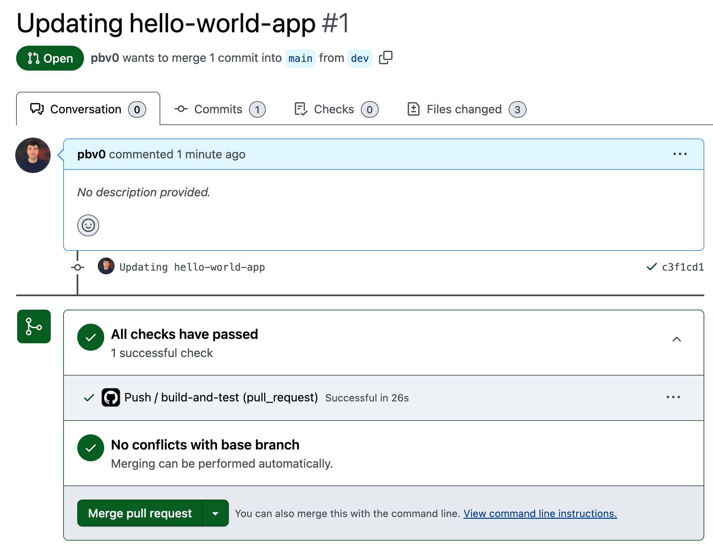
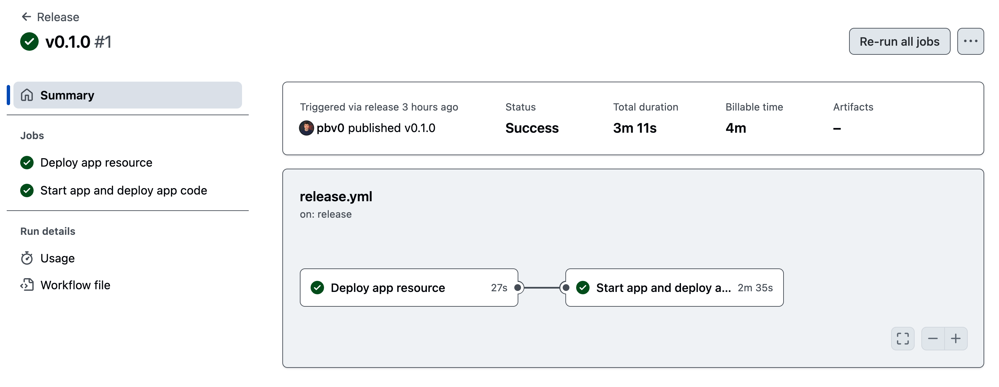
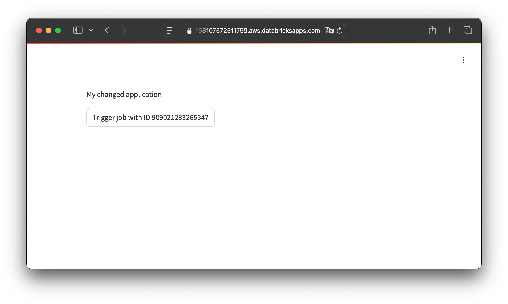

[Databricks Apps](https://www.databricks.com/product/databricks-apps) is the fastest and most secure way to build data and AI applications on the [Databricks Data Intelligence Platform](https://www.databricks.com/). Support for local development, Git version control, and CI/CD pipelines enable secure, repeatable deployments and a great developer experience whether you prefer working in your local IDE or Databricks workspace.

Databricks Apps is supported by the Databricks [REST API](https://docs.databricks.com/api/workspace/apps), [CLI](https://docs.databricks.com/aws/en/dev-tools/cli/), [Python SDK](https://databricks-sdk-py.readthedocs.io/en/latest/workspace/apps/apps.html), [Databricks Asset Bundles (DABs)](https://docs.databricks.com/aws/en/dev-tools/bundles/), and [Terraform](https://registry.terraform.io/providers/databricks/databricks/latest/docs/resources/app). Using these tools, you can set up powerful automations that integrate with your existing development and deployment workflows.

This blog post demonstrates how you can quickly set up a CI/CD pipeline using DABs and [GitHub Actions](https://github.com/features/actions). The associated GitHub repository provides a starting point and reference for your own deployments.

## Overview

In the following sections of this blog post, you will set up a deployment pipeline that allows for local testing and development of your application, on-demand deployments to a live Databricks development environment, and fully automated deployments to a production environment.

The following picture shows the overall development and deployment flow:



1. **Develop and run your app on your local machine** and execute unit tests.
2. **Deploy your app to the development environment** to test it on Databricks using the Databricks CLI.
3. **Push code changes** to your GitHub repository.
4. **Run automated code quality tests** in GitHub Actions.
5. **Create a release** to trigger an automated production deployment using GitHub Actions.

The following guide is intended as a minimal example to get you started quickly. Depending on your needs, you can expand to more environment stages, apply your preferred approach to Git to branch management, and make other adjustments.

## Setting up your CI/CD pipeline

### Prerequisites

- Python 3.11 or later
- [Databricks CLI](https://docs.databricks.com/aws/en/dev-tools/cli/) 0.18.0 or later
- [U2M OAuth authentication](https://docs.databricks.com/aws/en/dev-tools/cli/authentication#oauth-user-to-machine-u2m-authentication) set up for your workspace

### Project setup and overview

First, [fork](https://docs.github.com/en/pull-requests/collaborating-with-pull-requests/working-with-forks/fork-a-repo) the sample GitHub repository and clone the fork to your local machine:

```bash
git clone https://github.com/pbv0/databricks-apps-dabs
cd databricks-apps-dabs
```

Our example app source code is contained in `src/app/app.py`. The app code simply defines a Streamlit button which triggers a [job in Databricks Workflows](https://docs.databricks.com/aws/en/jobs/) using the [Databricks SDK for Python](https://databricks-sdk-py.readthedocs.io/en/latest/):

```py title="src/app/app.py"
import os
import streamlit as st
from databricks.sdk import WorkspaceClient

JOB_ID = os.getenv("JOB_ID")

w = WorkspaceClient()


if st.button(f"Trigger job with ID {JOB_ID}"):
    try:
        response = w.jobs.run_now(job_id=JOB_ID)
        st.success("Job started successfully!")
    except Exception as e:
        st.error(e)
```

This code gets a `JOB_ID` from an environment variable which is populated by our DABs bundle on deployment.

The [`WorkspaceClient`](https://databricks-sdk-py.readthedocs.io/en/latest/clients/workspace.html#databricks.sdk.WorkspaceClient) allows the app to interact with Databricks resources. When running locally, [U2M OAuth authentication](https://docs.databricks.com/aws/en/dev-tools/cli/authentication#oauth-user-to-machine-u2m-authentication) allows the app to automatically pick up your default credentials configured for the Databricks CLI. When deployed to a Databricks workspace, the `WorkspaceClient` automatically uses the credentials of the app’s service principal to authenticate.

The app uses the [`run_now`](https://databricks-sdk-py.readthedocs.io/en/latest/workspace/jobs/jobs.html#databricks.sdk.service.jobs.JobsExt.run_now) method to trigger a job run.

The app code runs on an app resource which is defined under `resources/app.yml`:

```yml title="resources/app.yml"
resources:
  apps:
    hello-world-app:
      name: "hello-world-app"
      source_code_path: ../src/app
      description: "A Streamlit app that lets users trigger the job included in this bundle."
      config:
        command:
          - "streamlit"
          - "run"
          - "app.py"
        env:
          - name: JOB_ID
            value: ${resources.jobs.hello_world.id}

      resources:
        - name: "app-job"
          description: "A job that can be invoked by this app."
          job:
            id: ${resources.jobs.hello_world.id}
            permission: "CAN_MANAGE_RUN"
```

This `app.yml` contains the resource-level configuration for our app. It defines:

- Where the app source code can be found: `../src/app`
- Which command to run to start the app: `streamlit run app.py`
- Which environment variables to pass to the app: the `JOB_ID` of the job which is also created as part of the DABs bundle under `resources/job.yml`
- Which resources the app’s service principal is permitted to use: again the job which is also created as part of the DABs bundle with the `CAN_MANAGE_RUN` permission

Before deploying the DABs bundle, let’s first run and test the app locally.

### Local development

To run and test the app locally, create a [Python virtual environment](https://docs.python.org/3/library/venv.html) where you can install the app’s dependencies:

```bash
python3 venv -m .venv
source .venv/bin/activate
pip install -r src/app/requirements.txt
```

You can now run the sample app on your local machine, make any changes, and add unit tests that should run locally.

```bash
streamlit run src/app/app.py
```



To test triggering a workflow when running the app locally, you would additionally need to pass in a valid `JOB_ID` as an environment variable.

The sample repository includes a simple test case in `src/app/tests/test_app.py` that uses [Streamlit’s app testing framework](https://docs.streamlit.io/develop/api-reference/app-testing) to check if the app starts without an exception. Let’s run this test locally with [`pytest`](https://pypi.org/project/pytest/):

```bash
python -m pytest
```

GitHub Actions will later run the same tests automatically.

Make sure you have [set up U2M OAuth authentication](https://docs.databricks.com/aws/en/dev-tools/cli/authentication#oauth-user-to-machine-u2m-authentication) for the Databricks CLI so that you can deploy DABs to your development and production environments.

Once OAuth authentication is set up, an app running on your local machine can call Databricks resources using your personal credentials with the Databricks Python SDK.

### Environment setup

The environments used by the sample DAB are defined in the asset bundle definition located at the root of the project folder as `databricks.yml`:

```yml title="databricks.yml"
[...]

targets:
  dev:
    mode: development
    default: true
    workspace:
      host: <workspace-url> # change to your own host URL
  prod:
    mode: production
    workspace:
      host: <workspace-url> # change to your own host URL
      root_path: /Workspace/Users/${workspace.current_user.userName}/.bundle/${bundle.name}/${bundle.target}
    permissions:
      - user_name: ${workspace.current_user.userName}
        level: CAN_MANAGE
```

The example bundle defines two environments: a default development environment and a production environment. Both environments are defined by their host URL. Based on your needs, you can expand this to include more stages, such as a staging or QA stage.

For the sake of this guide, you can designate the same workspace as dev and prod target. This way, both dev and prod resources will be deployed in the same workspace.

You can differentiate them via a dev prefix that is added automatically. In a production setting, we recommend you designate two separate workspaces as dev and prod targets.

See the [DABs documentation](https://docs.databricks.com/aws/en/dev-tools/bundles/settings) for a detailed syntax reference for bundle definition files.

### Deploying to your development environment

To test if the app also runs in Databricks, let’s deploy it to your development environment in a Databricks workspace using the Databricks CLI:

```bash
databricks bundle deploy -t dev
```

This command will create a Databricks Apps compute resource and upload the project code, including the app code, to the workspace path defined as `root_path` in the project’s `databricks.yml` file.

Once the command is executed, the app resource is still stopped, and no code has been deployed yet:



To start your app resource and run the first code deployment, run the following command:

```bash
databricks bundle run hello-world-app -t dev
```

After your app resource is started and the deployment is completed, the CLI and UI will output your app's URL.


Confirm that your app runs as expected before moving to the next section.



### Preparing your service principal

Automated deployments to your production environment can be performed from GitHub Actions using the same Databricks CLI commands used in the previous section.

Create a service principal to give GitHub Actions the necessary permissions to securely run these commands. To create a service principal for your production workspace, follow [this guide](https://docs.databricks.com/aws/en/admin/users-groups/service-principals#add-a-service-principal-to-a-workspace-using-the-workspace-admin-settings). The service principal’s default permissions are sufficient for the purpose of this tutorial. Next, create an OAuth secret for the service principal by following [this guide](https://docs.databricks.com/aws/en/dev-tools/auth/oauth-m2m) and note down the client ID and client secret \- you will only see the secret here\.



In your GitHub repository, create three repository secrets following [this guide](https://docs.github.com/en/actions/security-for-github-actions/security-guides/using-secrets-in-github-actions) that we will later pass to the GitHub Action to access the service principal:

- `DATABRICKS_CLIENT_ID`: your SP’s client ID
- `DATABRICKS_CLIENT_SECRET`: your SP’s OAuth secret
- `DATABRICKS_HOST`: your Databricks workspace URL, for example: https://my-workspace.cloud.databricks.com/



In case you decided to deploy to two separate workspaces for dev and prod, you will also need to set up a service principal in each environment, add their secrets, and adjust the environment variables used in the following section.

With these secrets set up, let’s examine the GitHub Actions workflow included in the sample repository. This workflow automates deployments to your production environment.

### GitHub Actions setup

The sample project defines two [Github Actions](https://github.com/features/actions) workflows that enable continuous integration and continuous deployments.

The first workflow is defined in `./github/workflows/push.yml` and is triggered each time a pull request is created or code is pushed to the `main` branch of the repository:

```yml title=".github/workflows/push.yml"
[...]

on:
  pull_request:
    types: [opened, synchronize]
  push:
    branches:
      - main

[...]
```

The purpose of this workflow is to ensure code quality is maintained and tests pass before merging. Our minimal example includes running [`ruff`](https://pypi.org/project/ruff/) for linting and executing tests using [`pytest`](https://pypi.org/project/pytest/):

```yml title=".github/workflows/push.yml"
[...]

jobs:
  build-and-test:
    runs-on: ubuntu-latest
    steps:
      - uses: actions/checkout@v4

      - uses: actions/setup-python@v5
        with:
          python-version: "3.11"

      - run: |
          python -m pip install --upgrade pip
          pip install -r app/requirements.txt

      - run: |
          pip install pytest ruff streamlit

      - uses: astral-sh/ruff-action@v3
        with:
          src: "./app"

      - run: |
          python -m pytest app/tests -v
```

Adapt this workflow to fit your specific project by including additional code quality and security checks as well as tests.

The second workflow, defined in `./github/workflows/release.yml`, performs a production deployment and is triggered each time a new release is created in GitHub:

```yml title=".github/workflows/release.yml"
[...]

on:
  release:
    types: [published]

[...]
```

This workflow contains two jobs:

1. `deploy`: creates a Databricks Apps compute resource if it does not exist yet using the `databricks bundle deploy` CLI command.
2. `update_app`: triggers a new code deployment using the `databricks bundle run hello-world-app` CLI command.

```yml title=".github/workflows/release.yml"
[...]

jobs:
  deploy:
    name: 'Deploy app resource'
    runs-on: ubuntu-latest

    steps:
      - uses: actions/checkout@v4
      - uses: databricks/setup-cli@main

      - run: databricks bundle deploy
        working-directory: .
        env:
          DATABRICKS_HOST: ${{ secrets.DATABRICKS_HOST }}
          DATABRICKS_CLIENT_ID:  ${{ secrets.DATABRICKS_CLIENT_ID }}
          DATABRICKS_CLIENT_SECRET:  ${{ secrets.DATABRICKS_CLIENT_SECRET }}
          DATABRICKS_BUNDLE_ENV: prod

  update_app:
    name: 'Start app and deploy app code'
    runs-on: ubuntu-latest

    needs:
      - deploy

    steps:
      - uses: actions/checkout@v4
      - uses: databricks/setup-cli@main

      - run: databricks bundle run hello-world-app
        working-directory: .
        env:
          DATABRICKS_HOST: ${{ secrets.DATABRICKS_HOST }}
          DATABRICKS_CLIENT_ID:  ${{ secrets.DATABRICKS_CLIENT_ID }}
          DATABRICKS_CLIENT_SECRET:  ${{ secrets.DATABRICKS_CLIENT_SECRET }}
          DATABRICKS_BUNDLE_ENV: prod
```

The workflow uses the secrets you defined in the previous section and does not need to be adjusted at this point.

### Merging a change and triggering a production deployment

With the GitHub Action workflows set up, you can now commit code changes that trigger your continuous integration pipeline and create releases that trigger production deployments.

Start by making a change to the app code in `src/app/app.py`.

As it’s not a good practice to push code directly to the `main` branch, create a `dev` branch in your repository and push your changes to it:

```bash
git checkout -b dev
git add .
git commit -m "Updating hello-world-app"
git push -u origin dev
```

Next, [create a pull request](https://docs.github.com/en/pull-requests/collaborating-with-pull-requests/proposing-changes-to-your-work-with-pull-requests/creating-a-pull-request) that proposes merging the `dev` branch with the `main` branch. This will trigger the `push.yml` workflow.



Creating the PR triggers the `push.yml` GitHub Actions workflow:



After the code quality checks have passed, merge the pull request into the main branch.

Finally, to trigger a production deployment with these changes, you need to create a new release. To do so, first create a Git tag:

```bash
git pull
git checkout main
git tag -a v0.1.0 -m "Release version 0.1.0"
git push origin v0.1.0
```

Next, in the GitHub UI, [create a new release](https://docs.github.com/en/repositories/releasing-projects-on-github/managing-releases-in-a-repository) and select the `v.0.1.0` tag.

Creating the release triggers the workflow defined in `release.yml`:



Once the workflow has been completed successfully, you can see the new version of your app running in your production environment:



## Best practices for your Databricks Apps deployments

This blog post and the associated repository follow core best practices for CI/CD security, stability, and code quality.

To further enhance security, consider [protecting the main branch](https://docs.github.com/en/repositories/configuring-branches-and-merges-in-your-repository/managing-protected-branches/managing-a-branch-protection-rule) of your repository from contributors directly pushing code and triggering a production deployment. In addition to pull requests triggering automated tests, enforce code reviews and add a manual approval step to pull requests.

Consider developing code in [feature branches](https://git-scm.com/book/en/v2/Git-Branching-Branching-Workflows) before merging into the development branch.

Create separate environments for the different stages of application code development, such as development, staging, and production, with clearly defined transitions between stages.

Production environments should not be used interactively. Instead, only service principals should deploy changes in these environments. Rotate service principal credentials regularly.

GitHub supports maintaining [environment-specific instead of repository-wide configurations and secrets](https://docs.github.com/en/actions/security-for-github-actions/security-guides/using-secrets-in-github-actions) that improve environment isolation.

Finally, setting up alerts and monitoring in [GitHub Actions offers real-time visibility](https://docs.github.com/en/actions/monitoring-and-troubleshooting-workflows/monitoring-workflows) into any pipeline failures or anomalies.

## Conclusion

Automating your Databricks Apps deployments with GitHub Actions and Databricks Asset Bundles helps maintain an organized, repeatable development and deployment process. This allows you to build and deploy data applications with Databricks Apps not only quickly but also at scale and with a great developer experience.

Use the GitHub repository associated with this blog post to get started with building your own deployment pipeline and take a look at the following resources to learn more about DABs:

- [Databricks Asset Bundles documentation](https://docs.databricks.com/aws/en/dev-tools/bundles/)
- [Databricks Asset Bundle project templates](https://docs.databricks.com/aws/en/dev-tools/bundles/templates)
- [Run a CI/CD workflow with a Databricks Asset Bundle and GitHub Actions](https://docs.databricks.com/aws/en/dev-tools/bundles/ci-cd-bundles)
