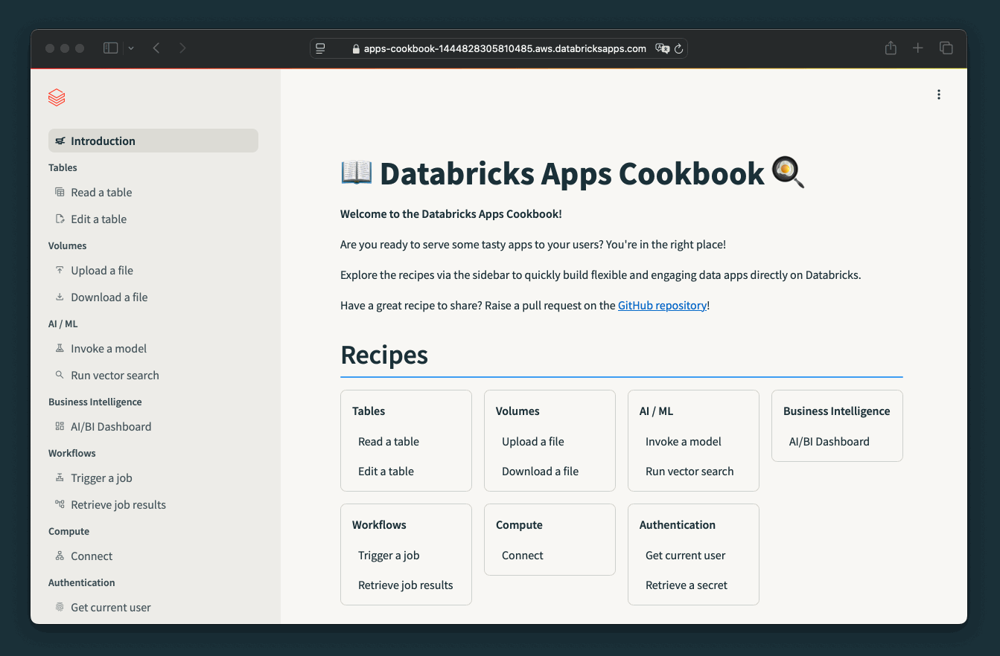

import Link from "@docusaurus/Link";

# Introduction

Welcome to the Databricks Apps Cookbook!

The Databricks Apps Cookbook contains ready-to-use code snippets for building interactive data and AI applications using [Databricks Apps](https://docs.databricks.com/en/dev-tools/databricks-apps/index.html).

These code snippets cover common use cases such as reading and writing to and from **tables** and **volumes**, invoking traditional **ML models** and GenAI, or triggering **workflows**.

For each snippet, you will find the **source code**, required **permissions**, list of **dependencies**, and any other information needed to implement it.

Currently, we offer snippets for [Streamlit](/docs/category/streamlit), [Dash](/docs/category/dash), and [FastAPI](/docs/category/fastapi) and they can be easily adapted to other Python frameworks.

    <Link to="/docs/category/streamlit">
        <button className="inline-flex items-center border-2 border-lava-600 px-8 py-2.5 text-center align-middle text-lg font-semibold text-lava-600 hover:cursor-pointer hover:border-lava-700 hover:underline bg-transparent hover:cursor-pointer">
            
            Build with Streamlit
        </button>
    </Link>
    <Link to="/docs/category/dash">
        <button className="inline-flex items-center border-2 border-lava-600 px-8 py-2.5 text-center align-middle text-lg font-semibold text-lava-600 hover:cursor-pointer hover:border-lava-700 hover:underline bg-transparent hover:cursor-pointer">
            
            Build with Dash
        </button>
    </Link>
    <Link to="/docs/category/fastapi">
        <button className="inline-flex items-center border-2 border-lava-600 px-8 py-2.5 text-center align-middle text-lg font-semibold text-lava-600 hover:cursor-pointer hover:border-lava-700 hover:underline bg-transparent hover:cursor-pointer">
            
            Build with FastAPI
        </button>
    </Link>

## Interactive samples

You can find **interactive sample implementations** for each snippet in the [databricks-apps-cookbook](https://github.com/pbv0/databricks-apps-cookbook) GitHub repository. Take a look at the [deployment instructions](/docs/deploy) to **run them locally** or **deploy to your Databricks workspace**.

## Contributing

We welcome contributions! Submit a [pull request](https://github.com/pbv0/databricks-apps-cookbook/pulls) to add or improve recipes. Raise an [issue](https://github.com/pbv0/databricks-apps-cookbook/issues) to report a bug or raise a feature request.
